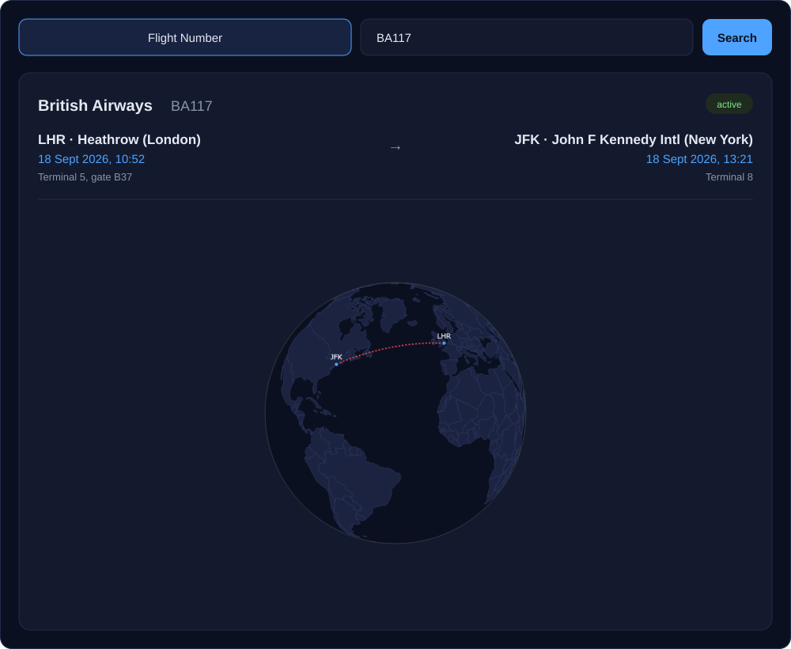

<p align="center">
  
</p>

<p align="center">
  
  
  
</p>

A local web app for looking things up about flying. Search an aircraft model and get its photo and specs straight from Wikipedia. Search a flight number and get its route — departure and arrival airports, terminal, gate, and actual times — drawn as a red dotted great-circle line on a spinning globe. Runs entirely on your own machine; no accounts, no database to set up.

<p align="center">
  
</p>

## Features

- **Aircraft model search** — free-text query resolved to a Wikipedia page, showing its photo, description, and a best-effort parsed set of specs (manufacturer, first flight, status, production period, capacity/fuel capacity when Wikipedia's infobox has them).
- **Flight number search** — departure/arrival airport, local time, date, terminal, and gate via [Aviationstack](https://aviationstack.com), plus aircraft type and registration.
- **Interactive route globe** — the searched route is rendered as a red dotted great-circle arc on a rotatable orthographic globe, using offline airport coordinates (no extra API call).
- **No accounts, no database** — aircraft search needs no key at all; flight search needs one free Aviationstack key you paste into `.env`. Nothing else to configure.
- **One command to run** — `flight-database` starts a local server and opens the app in your browser.

## Install

```bash
git clone git@github.com:livelstorborg/flight-database.git ~/Developer/flight-database
cd ~/Developer/flight-database
python3 -m venv .venv
source .venv/bin/activate
pip install -r requirements.txt
ln -sf ~/Developer/flight-database/bin/flight-database ~/.local/bin/flight-database
```

The launcher script lives in the repo at `bin/flight-database` and is
symlinked into `~/.local/bin/flight-database`, which needs to be on `PATH`
(it already is here via `.zshrc`).

## Run

```bash
flight-database
```

Starts a local server on `http://127.0.0.1:8000` and opens it in your
browser automatically. Stop it with `Ctrl+C` in the terminal.

## API key for flight number search

| Search | Cost | Setup |
|---|---|---|
| **Aircraft model** | Free, no signup | Nothing — uses the public Wikipedia API |
| **Flight number** | Free tier, 500 req/month | Aviationstack key in `.env` |

Flight number search uses [Aviationstack](https://aviationstack.com) to fetch
actual departure/arrival times and dates. It's a standalone service (not via
RapidAPI) — plain email signup, no credit card:

1. Create a free account directly at [aviationstack.com/signup/free](https://aviationstack.com/signup/free).
2. After signing up, find your **API Access Key** on the dashboard
   (aviationstack.com/dashboard).
3. Copy `.env.example` to `.env` and paste in the key:

   ```bash
   cp .env.example .env
   open -e .env
   ```

   Edit `.env`:

   ```
   AVIATIONSTACK_API_KEY=your_key_here
   ```

Without a key, aircraft model search works normally, but flight number search
shows an error saying the key is missing.

## Routes and layovers

Aviationstack's free-tier flight-status endpoint only reports a single
departure/arrival pair per flight number — it doesn't expose technical
stopovers. The route-drawing code is written to handle any number of
waypoints (it draws one great-circle segment per consecutive pair), so a
layover only needs a data source that reports the intermediate airport; no
frontend changes would be needed.

Many modern airliner family Wikipedia pages (737 MAX, A320neo, ...) also put
capacity and fuel capacity in prose instead of the infobox — those spec
fields are then simply omitted, but the description text usually covers it
anyway.

## Architecture

| File | Responsibility |
|---|---|
| `bin/flight-database` | CLI launcher — starts uvicorn, opens a browser tab |
| `backend/main.py` | FastAPI app: serves the frontend + the two search endpoints |
| `backend/wiki.py` | Aircraft model lookup against Wikipedia |
| `backend/flights.py` | Flight number lookup against Aviationstack |
| `backend/airports.py` | Offline IATA/ICAO → coordinates lookup (`airportsdata`) |
| `backend/config.py` | Reads `.env` |
| `frontend/` | Plain HTML/CSS/JS UI; Plotly.js (via CDN) renders the globe/route view |

All state is just your `.env` file — no database, no accounts, nothing else
persisted on disk.
